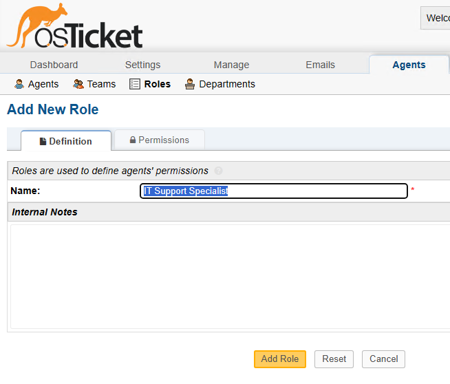
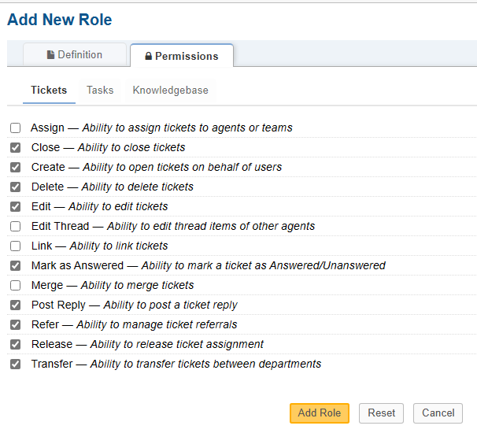
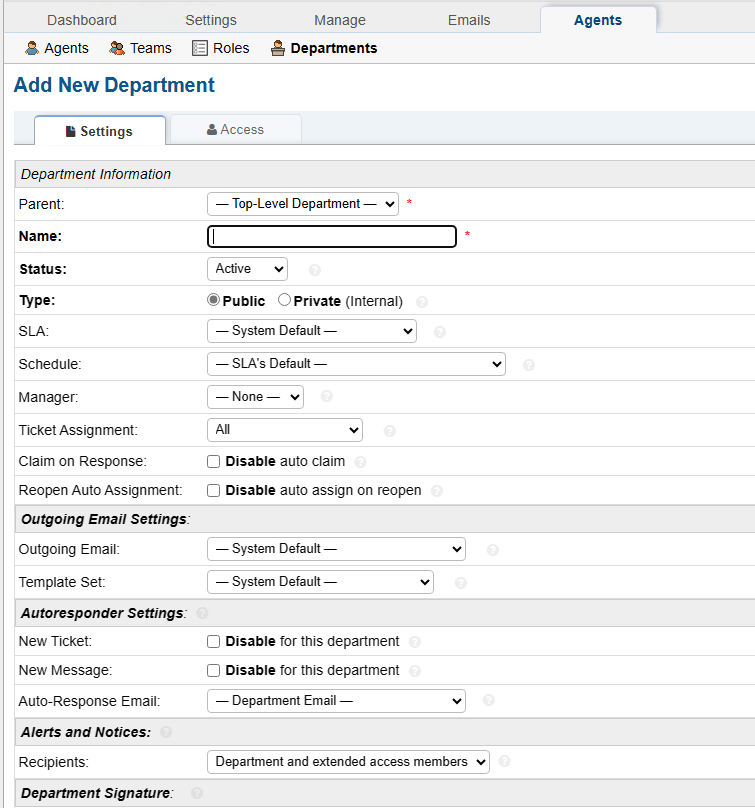
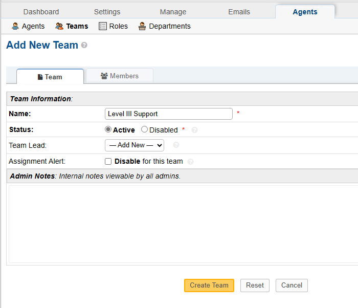
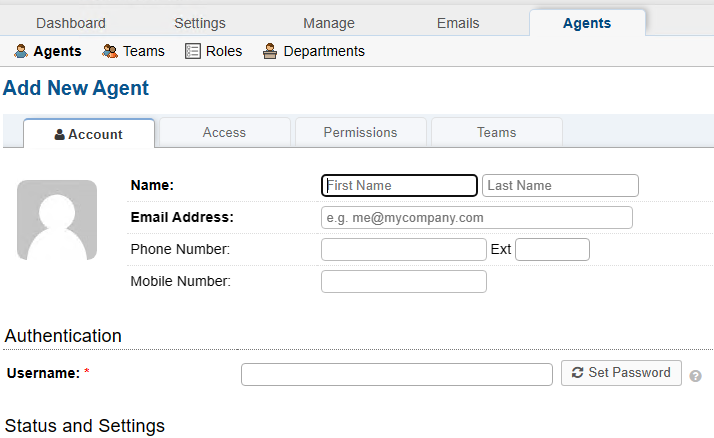
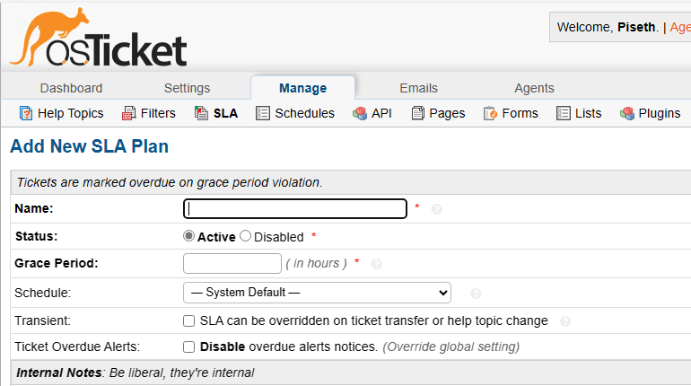

# Post-Installation-Setup using OsTicket Software

<h4>Project Objectives</h4>

<ol>
    <li>Configure Roles</li>
    <li>Configure Department</li>
    <li>Configure Team</li>
    <li>Configure Agent- IT Support </li>
    <li>Configure Users- Customers</li>
    <li>Configure SLA- Customers</li>
    <li>Configure Users- Customers</li>
</ol>

<h4>Configure Roles</h4>

<h5>Step One</h5>

<ol>
    <li>Login Using OsTicket Admin</li>
    <li>Click On Admin Panel ==> Agents ==> Role ==> Add New Role</li>
    
   

 
 <li>Permission</li>

 

   
 <li>Click On Add Role</li>

</ol>

+Roles should be added to the table

<h4>Configure Department</h4>

<h5>Step One</h5>

<ol>
    <li>Click On Admin Panel ==> Agents ==> Department ==> Add New Department</li>
    
    
    
   

    
    <li>You can Either update the setting your create with default setting</li

<h4>Configure Teams</h4>

 allow you to pull Agents from different Departments and organize them to handle a specific issue or user via a Help Topic or Ticket Filter.

<h5>Step One</h5>

<ol>
    <li>Click On Admin Panel ==> Agents ==> Teams ==> Add New Teams</li>
       

<h3>Allowed Anyone to create Tickets<h3>

Admin Panel > Setting > Users > Setting : Unchecked "Registeration Method " Set to Public. 

 

<h3>Allowed Anyone to create Tickets<h3>

 Agents are given access to the help desk with the intent to respond and resolve the tickets

<h4>Step One: </h4>
<li>Click On Admin Panel ==> Agents ==> Agents ==> Add New Agent</li>
  

<li>You can add Access , Permission as you wish.</li>

<h4>Configure SLA</h4>

 SAL Plans or Service Level Agreements, are unlimited in osTicket. The purpose of the SLA Plan is to provide a length of time in which the help desk Administrator expects tickets to be closed.

<h5>Step One</h5>

<ol>
    <li>Click On Admin Panel > Manage > SLA > Add New SLA</li>
       

